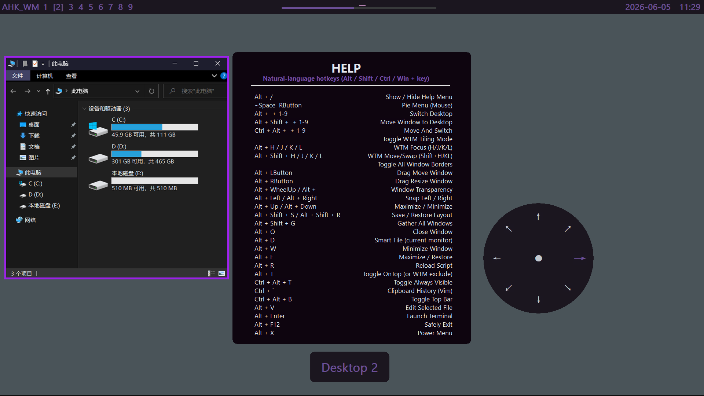
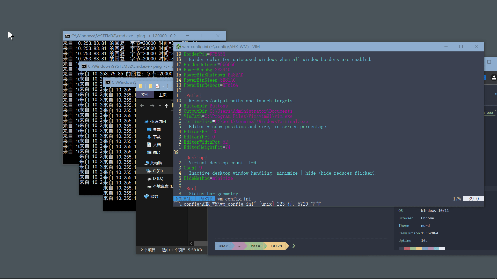
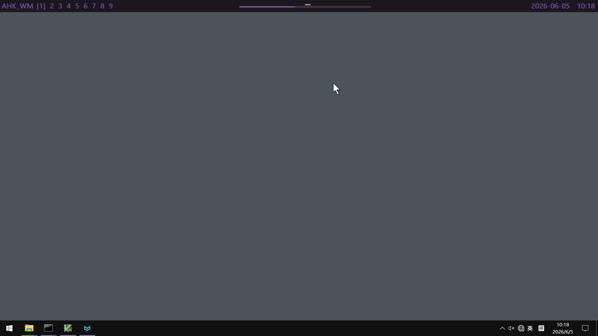
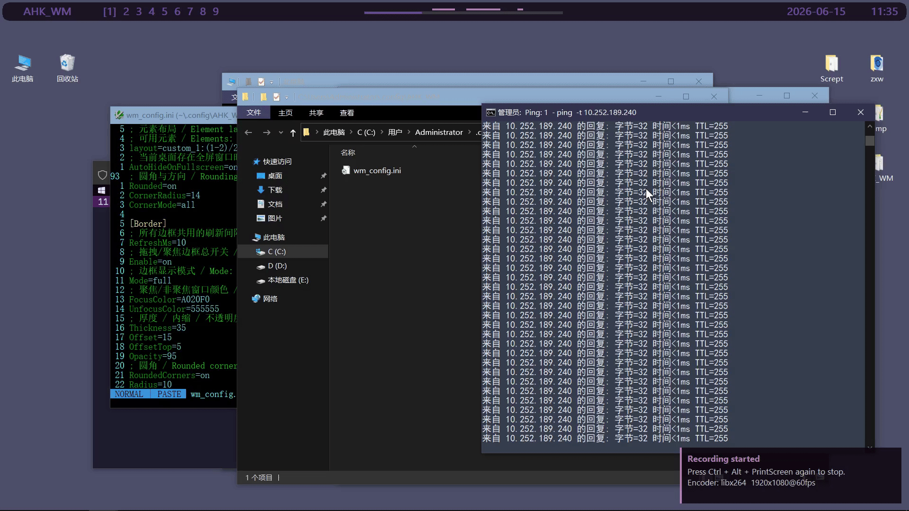
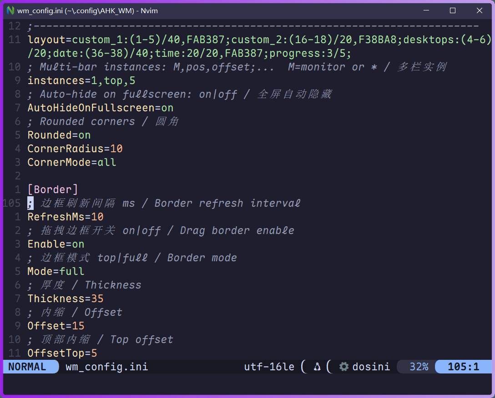
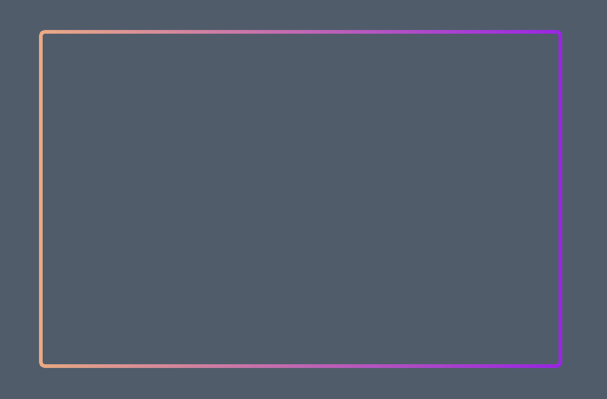
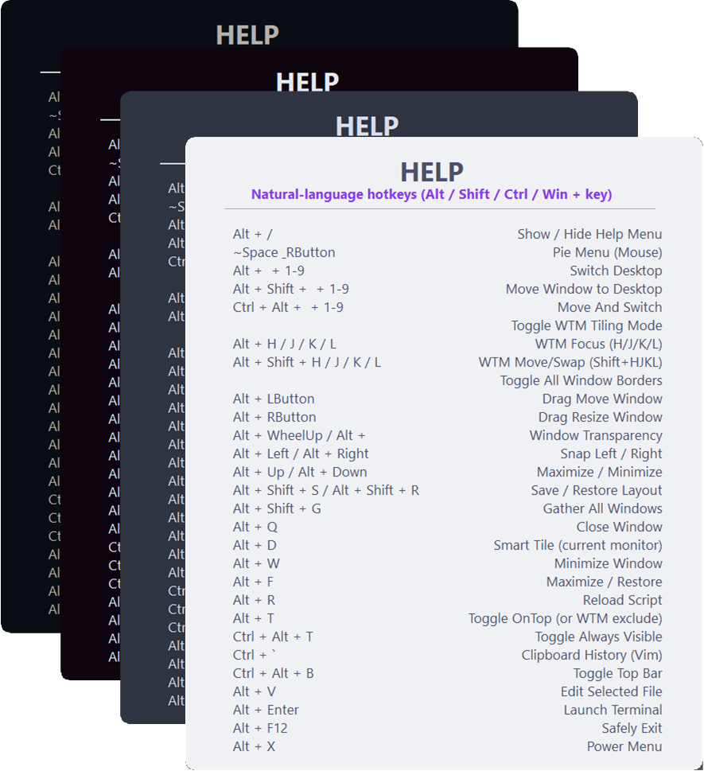

<div align="center">

# 🔲 AHK WM <sub>v2.9.0</sub>

<p>
  
  
  
  
</p>

<p>
  <a href="README.md"></a>
  <a href="README-zh.md"></a>
</p>

**轻量、快速、单文件的 Windows 窗口管理器 — AutoHotkey v2 驱动**

</div>

<p align="center">
  
</p>

---

## 📑 目录

- [✨ 功能概览](#-功能概览)
- [📸 截图](#-截图)
- [📦 安装](#-安装)
- [🚀 快速上手](#-快速上手)
- [🧰 详细功能](#-详细功能)
- [🔌 外部接口](#-外部接口)
- [⚙️ 配置](#️-配置)
- [🛠️ 更新日志](CHANGELOG-zh.md)
- [🔮 路线图](#-路线图)
- [❓ 常见问题](#-常见问题)
- [🤝 参与贡献](#-参与贡献)
- [📄 许可](#-许可)

---

## ✨ 功能概览

|  |  |  |
|---|---|---|
| 🖥️ **9 个虚拟桌面** | 快捷键切换、移动、收集窗口 | 🧩 **智能平铺** | 一键按显示器布局 |
| 📊 **状态栏** | 渐变、圆角、多显示器 | 🎨 **20+ 主题** | Nord、Dracula、Catppuccin 等 |
| 🥧 **饼菜单** | 空格 + 右键 | ⌨️ **WTM 模式** | Hyprland 风格键盘平铺 |
| ✋ **KDE 风格拖拽** | Alt + 任意位置拖拽移动/缩放 | 🔤 **WinSelect** | 字母标注快速切换窗口 |
| 📋 **剪贴板历史** | 内置记录和查看 | 🔌 **外部接口** | WM_COPYDATA 推送 OSD 和 Bar 部件 |
| ⏱️ **工作计时** | 可配置的进度条 | 📐 **吸附** | 拖拽吸附、可配置阈值 |

> 两年日常使用打磨。因为市面上的 Windows WM 都太重了，而且别人根本没法用我的电脑。

---

## 📸 截图

| 预览 | 说明 |
|---------|-------------|
|  | 桌面概览 — 边框、平铺、多窗口布局 |
|  | 智能平铺 — 一键排布所有窗口 |
|  | 饼菜单 — 空格 + 右键 |
|  | WinSelect — 字母标注覆盖层 |
|  | 状态栏 — 渐变部件、圆角 |
|  | 渐变边框 — 聚焦/非聚焦颜色切换 |
|  | 边框实战 — 平铺窗口彩色边框 |
|  | 内置帮助 — Alt + / 查看所有快捷键 |

---

## 📦 安装

1. 安装 **AutoHotkey v2** → https://www.autohotkey.com/
2. 下载 `wm.ahk`：[最新版本](https://github.com/EngineeringMechanicsB/AHK_WM/releases/latest)
3. **以管理员身份运行**（否则对管理员窗口无效）

<p align="center">
  <a href="https://github.com/EngineeringMechanicsB/AHK_WM/releases/latest">
    
  </a>
</p>

> ⚠️ 饼菜单自定义等高级功能需要 AHK v2。推荐直接运行 `.ahk` 脚本。

---

## 🚀 快速上手

| 操作 | 快捷键 |
|--------|--------|
| 📖 帮助 | `Alt + /` |
| 🧩 平铺当前显示器 | `Alt + D` |
| ✋ 拖拽移动窗口 | `Alt + 鼠标左键` |
| 📐 拖拽缩放窗口 | `Alt + 鼠标右键` |
| 🔄 切换桌面 1~9 | `Alt + 1 ~ 9` |
| 📦 移动窗口到桌面 | `Alt + Shift + 1 ~ 9` |
| 🚀 移动并跟随 | `Ctrl + Alt + 1 ~ 9` |
| 📊 开关状态栏 | `Ctrl + Alt + B` |
| ⌨️ WTM 键盘平铺 | `Ctrl + Alt + T` |
| 💾 保存布局 | `Alt + Shift + S` |
| 🧲 收集所有窗口 | `Alt + Shift + G` |
| 📌 窗口置顶 | `Alt + T` |
| 🔃 重载脚本 | `Alt + R` |
| 🥧 饼菜单 | `空格 + 鼠标右键` |
| ⚡ 电源菜单 | `Alt + X` |

---

## 🧰 详细功能

| 功能 | 说明 |
|---------|-------------|
| 🖥️ **虚拟桌面** | 9 个独立桌面，可通过快捷键切换（`Alt+N`）、移动窗口（`Alt+Shift+N`）或带窗口切换（`Ctrl+Alt+N`）。非当前桌面窗口可最小化或隐藏。 |
| 🧩 **智能平铺** | 一键铺满当前显示器。支持按显示器自定义布局规则和间距。 |
| ✋ **KDE 风格拖拽** | 按住 `Alt` 在窗口任意位置拖拽即可移动，不限于标题栏。`Alt + 右键` 拖拽缩放。 |
| 🥧 **饼菜单** | 按住 `空格`，点右键出现径向菜单，朝不同方向移动鼠标触发对应操作。 |
| 📊 **状态栏** | 多显示器状态栏，支持渐变色、圆角、每个元素独立对齐。显示桌面标签、时间、日期、进度条、系统状态和自定义部件。 |
| 🖼️ **窗口边框** | 活动/非活动窗口彩色边框，支持渐变。`Ctrl+Alt+B` 开关。 |
| ⌨️ **WTM 模式** | 全键盘窗口管理：HJKL 移动焦点和交换窗口，`Ctrl+HJKL` 调整大小，`Alt+HJKL` 吸附。 |
| 📐 **窗口吸附** | 拖拽窗口到屏幕边缘或其他窗口时自动吸附，可配置吸附距离和脱离距离。 |
| 🎨 **主题** | 20+ 内置主题，一键导出当前主题为自定义配色。 |
| ⏱️ **工作计时** | 可配置的工作时段，状态栏显示进度条。 |
| 📋 **剪贴板历史** | 自动记录所有复制文本到文件，带时间戳。 |
| ⚡ **电源菜单** | 关机 / 休眠 / 重启菜单，渐变按钮。 |

---

## 🔌 外部接口

AHK_WM 监听 `WM_COPYDATA` 消息，外部脚本可以向**状态栏**推送文本或在**屏幕中央**弹出通知。

### OSD（屏幕提示）

```ahk
; AHK_WM 需在运行中
AHK_WM_OSD(text, duration := 1000) {
    DetectHiddenWindows(true)
    h := WinExist("wm.ahk ahk_class AutoHotkey")
    if !h
        return false
    payload := "OSD:" . text . ":" . duration
    c := StrPut(payload, "UTF-16")
    b := Buffer(A_PtrSize * 3, 0)
    NumPut("Ptr", 0, b, 0), NumPut("UInt", c, b, A_PtrSize), NumPut("Ptr", StrPtr(payload), b, A_PtrSize * 2)
    SendMessage(0x4A, 0, b.Ptr, , "ahk_id " . h)
    return true
}
AHK_WM_OSD("编译完成！", 3000)
```

### Bar 自定义部件（`external_N`）

在 `[Bar] Layout` 中添加 `external_N`，然后从其他脚本推送文本：

```ahk
WMBarPush(slot, text) {
    DetectHiddenWindows(true), SetTitleMatchMode(2)
    target := WinExist("wm.ahk ahk_class AutoHotkey")
    if !target
        return false
    msg := "BAR:" . slot . ":" . text
    size := (StrLen(msg) + 1) * 2, buf := Buffer(size, 0)
    StrPut(msg, buf, "UTF-16")
    cds := Buffer(A_PtrSize * 3, 0)
    NumPut("Ptr", 0, cds, 0), NumPut("UInt", size, cds, A_PtrSize), NumPut("Ptr", buf.Ptr, cds, A_PtrSize * 2)
    res := 0
    DllCall("User32\SendMessageTimeoutW", "Ptr", target, "UInt", 0x4A, "Ptr", A_ScriptHwnd, "Ptr", cds.Ptr, "UInt", 0x2, "UInt", 2000, "UInt*", &res, "Ptr")
    return true
}
WMBarPush(1, "来自外部脚本")
```

### Claude Code 集成

在 `.claude/settings.json` 中配置 hook，Claude Code 完成后自动弹出通知：

```json
{
  "hooks": {
    "Stop": [
      { "command": "C:\\Users\\Administrator\\Desktop\\AHK_WM\\osd-examples\\osd-claude-done.ahk" }
    ]
  }
}
```

每次 Claude Code 跑完就会看到 `🤖 Claude Code run Completed！`。同样的套路适用于任何能执行 `.ahk` 的工具——任务计划、CI 流水线、构建脚本都行。

📂 `bar-examples/` 和 `osd-examples/` 有 12 个开箱即用的示例（中英文、详细注释）。

---

## ⚙️ 配置

<p align="center">
  <a href="docs/config-reference-zh.md">
    
  </a>
</p>

所有配置在 `%USERPROFILE%\.config\AHK_WM\wm_config.ini` 中。编辑后按 `Alt + R` 重载即可，无需重启。

---

## 🔮 路线图

- **WTM 边框清理** — 消除窗口关闭/退出模式时的边框残留
- **包管理器** — Scoop、Chocolatey、winget 分发

---

## ❓ 常见问题

| 现象 | 解决 |
|------|------|
| 管理员窗口快捷键无效 | 以管理员身份运行脚本 |
| 饼菜单自定义不生效 | 安装 AHK v2（仅 exe 不够） |
| 游戏/UWP 行为异常 | 加入 `[Exclude]` 排除列表 |
| 状态栏被全屏遮挡 | 设计如此，用 `Ctrl+Alt+B` 切换 |
| 边框偏移 | 调整 `Border` 粗细或圆角 |

---

## 🤝 参与贡献

- 🐛 **Bug 报告** — 提交 Issue，附重现步骤和 Windows 版本
- 💡 **功能建议** — 提交带 `enhancement` 标签的 Issue
- 🔧 **Pull Request** — 欢迎。大改动请先开 Issue 讨论。
- 🎨 **主题** — 附带截图提交。

---

## 📄 许可

[MIT](LICENSE) © 2024-2026 EngineeringMechanicsB
