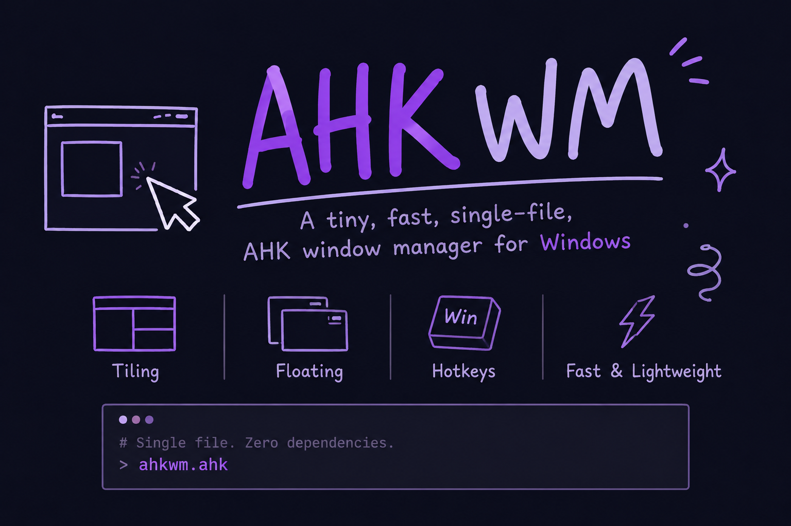

<div align="center">

# 🔲 AHK WM <sub>v2.10.0</sub>

<p>
  
  
  
  
</p>

<p>
  <a href="README.md"></a>
  <a href="docs/README-zh.md"></a>
</p>
**A tiny, fast, single-file window manager for Windows — powered by AutoHotkey v2.**

</div>

<p align="center">
  
</p>

<p align="center">
  
</p>

---

## 📑 Contents

- [✨ Features](#-features)
- [📸 Screenshots](#-screenshots)
- [📦 Installation](#-installation)
- [🚀 Quick Start](#-quick-start)
- [🧰 Detailed Features](#-detailed-features)
- [🔌 External Interfaces](#-external-interfaces)
- [⚙️ Configuration](#️-configuration)
- [🛠️ Changelog](docs/CHANGELOG.md)
- [🔮 Roadmap](#-roadmap)
- [❓ Troubleshooting](#-troubleshooting)
- [🤝 Contributing](#-contributing)
- [📄 License](#-license)

---

## ✨ Features

|  |  |  |
|---|---|---|
| 🖥️ **9 Virtual Desktops** | Switch, move, gather via hotkeys | 🧩 **Smart Tiling** | One-key layout per monitor |
| 📊 **Status Bar** | Gradient, rounded, multi-monitor | 🎨 **20+ Themes** | Nord, Dracula, Catppuccin, etc. |
| 🥧 **Pie Menu** | Space + Right Mouse | ⌨️ **WTM Mode** | Hyprland-like keyboard tiling |
| ✋ **KDE-style Drag** | Alt + drag anywhere to move/resize | 🔤 **WinSelect** | Letter-labeled overlay for quick switching |
| 📋 **Clipboard History** | Built-in logger & viewer | 🔌 **External API** | OSD & bar widgets via WM_COPYDATA |
| ⏱️ **Work Timer** | Configurable progress bar | 📐 **Snapping** | Drag-to-snap, configurable thresholds |

> Two years of daily-use refinement. Built because every other Windows WM was too heavy and made my machine unusable for anyone else.

<p align="center">
  
</p>

## 📸 Screenshots

| Preview | Description |
|---------|-------------|
|  | Desktop overview — borders, tiling, multi-window layout |
|  | Smart Tiling — one key arranges all windows |
|  | Pie Menu — radial menu, Space + Right Mouse |
|  | WinSelect — letter-labeled overlay |
|  | Status Bar — gradient widgets, rounded corners |
|  | Gradient Borders — focus/unfocus with gradient colors |
|  | Border in action — colored frames around tiled windows |
|  | Built-in Help — Alt + / for full hotkey reference |

---

<p align="center">
  
</p>

## 📦 Installation

1. Install **AutoHotkey v2** → https://www.autohotkey.com/
2. Download `wm.ahk` from the [latest release](https://github.com/EngineeringMechanicsB/AHK_WM/releases/latest)
3. **Run as Administrator** (required for elevated windows)

<p align="center">
  <a href="https://github.com/EngineeringMechanicsB/AHK_WM/releases/latest">
    
  </a>
</p>

> ⚠️ Pie menu customization and some advanced features require AHK v2. Running the `.ahk` script is recommended.

---

## 🚀 Quick Start

| Action | Hotkey |
|--------|--------|
| 📖 Help page | `Alt + /` |
| 🧩 Tile current monitor | `Alt + D` |
| ✋ Move window (anywhere) | `Alt + Left Mouse` |
| 📐 Resize window (anywhere) | `Alt + Right Mouse` |
| 🔄 Switch desktop 1~9 | `Alt + 1 ~ 9` |
| 📦 Move window to desktop | `Alt + Shift + 1 ~ 9` |
| 🚀 Move & follow to desktop | `Ctrl + Alt + 1 ~ 9` |
| 📊 Toggle status bar | `Ctrl + Alt + B` |
| ⌨️ WTM keyboard tiling | `Ctrl + Alt + T` |
| 💾 Save layout | `Alt + Shift + S` |
| 🧲 Gather all windows | `Alt + Shift + G` |
| 📌 Toggle always-on-top | `Alt + T` |
| 🔃 Reload script | `Alt + R` |
| 🥧 Pie menu | `Space + Right Mouse` |
| ⚡ Power menu | `Alt + X` |

<p align="center">
  
</p>

---

## 🧰 Detailed Features

| Feature | Description |
|---------|-------------|
| 🖥️ **Virtual Desktops** | 9 independent desktops. Switch (`Alt+N`), move windows (`Alt+Shift+N`), or move-and-follow (`Ctrl+Alt+N`). Inactive-desktop windows can be minimized or hidden. |
| 🧩 **Smart Tiling** | One key tiles all windows on the current monitor. Custom layout rules per monitor with gap control. |
| ✋ **KDE-style Drag** | Move windows by holding `Alt` + dragging anywhere (not just the title bar). Resize with `Alt + Right Mouse`. |
| 🥧 **Pie Menu** | Hold `Space`, then right-click: a radial menu appears. Move the mouse in a direction to trigger that action. |
| 📊 **Status Bar** | Multi-monitor bar with gradient colors, rounded corners, and per-element alignment. Shows desktops, clock, date, progress, system stats, and custom widgets. |
| 🖼️ **Window Borders** | Colored borders around active/inactive windows with live gradient support. Toggle with `Ctrl+Alt+B`. |
| ⌨️ **WTM Mode** | Full keyboard window management: HJKL to move focus and swap windows, `Ctrl+HJKL` to resize, `Alt+HJKL` to snap. |
| 📐 **Window Snapping** | Drag windows to screen edges or other windows to snap. Configurable snap/release distances. |
| 🎨 **Themes** | 20+ built-in themes (Nord, Dracula, Catppuccin, Gruvbox, Tokyo Night, Monokai…). Export any theme to custom in one click. |
| ⏱️ **Work Timer** | Configurable work period with progress bar on the status bar. |
| 📋 **Clipboard History** | Logs all copied text to a file with timestamps. |
| ⚡ **Power Menu** | Shutdown / Sleep / Reboot menu with gradient buttons. |

---

## 🔌 External Interfaces

AHK_WM listens for `WM_COPYDATA` messages. External scripts can push text to the **status bar** or pop up **center-screen notifications** — with full per-call visual customization.

### OSD (on-screen display)

```ahk
; Basic — uses config defaults
AHK_WM_OSD("Build passed!", 3000)

; With per-call overrides (all keys optional)
AHK_WM_OSD("Disk full!", 5000, "fs=36,bg=CC3333,tx=FFFFFF,op=95,pos=30")
```

**Available override keys** (see `docs/config-reference.md` for full table):

| Key | Meaning | Default |
|-----|---------|---------|
| `fs` | Font size | Config `OSDFontSize` (20) |
| `op` | Opacity % | Config `OSDOpacity` (78) |
| `pos` | Vertical position % | Config `OSDPositionPct` (80) |
| `x` / `y` | Pixel/percentage coordinates | *(center / config)* |
| `bg` / `tx` | Background / text color | Theme colors |
| `wr` | Max width (auto-wrap) | 85% monitor width |
| `rd` / `rr` | Rounded corners on/off + radius | Config values |
| `fn` | Font face | Config `FontName` |
| `tag` | Logical label (same-tag OSDs replace each other) | *(none)* |

External OSDs run in a separate instance pool — they never interfere with
`wm.ahk`'s own internal OSD popups.

### Bar custom widgets (`external_N`)

Like OSD, the bar exposes an external interface — push content from any script:
```ahk
WMBarPush(1, "0.5/0.8", "Now Playing: Hey Jude — The Beatles")
WMBarPush(2, "(200-550)/1920", "Take a sad song`nand make it better")  ; `n = newline, renders as 2 lines
```

### Bundled examples

Ready-to-run examples are in `docs/Examples/OSDExamples/` and `docs/Examples/BarExamples/`,
each with English (`En/`) and Chinese (`Ch/`) variants, heavily commented with full parameter docs.

### Claude Code integration

```json
{
  "hooks": {
    "Stop": [
      { "command": "C:\\Users\\Administrator\\Desktop\\AHK_WM\\docs\\Examples\\OSDExamples\\En\\osd-simple.ahk" }
    ]
  }
}
```

A simple config lets Claude Code pop an OSD on completion — the same idea works for task schedulers, CI pipelines, Pomodoro timers, whatever.

📂 `docs/Examples/OSDExamples/` and `docs/Examples/BarExamples/` — several ready-to-run demos to learn from.

<p align="center">
  
</p>

## ⚙️ Configuration

<p align="center">
  <a href="docs/config-reference.md">
    
  </a>
</p>

All configuration lives in `%USERPROFILE%\.config\AHK_WM\wm_config.ini`. Edit it, then press `Alt + R` to reload — no restart needed.

---

## 🔮 Roadmap

- **WTM mode** — the current WTM has many rough edges
- **Per-monitor desktops** — independent desktop switching per monitor
- **Package managers** — Scoop, Chocolatey, winget distribution
- **Window exclude rules** — current exclusion rules need improvement
- **Bar auto-hide & reveal** — currently only full hide; add occlusion-based auto-hide or transparency mode

---

## ❓ Troubleshooting

| Symptom | Fix |
|---------|-----|
| Hotkeys fail in admin windows | Run script as Administrator |
| Pie menu customization broken | Install AHK v2 (not just the .exe) |
| Borders look offset | Adjust `Border` thickness or radius |

---

## 🤝 Contributing

- 🐛 **Bug reports** — Open an issue with repro steps and Windows version
- 💡 **Feature requests** — Open an issue with the `enhancement` label
- 🔧 **Pull requests** — Welcome. For large changes, open an issue first.
- 🎨 **Themes** — Submit with a screenshot.

---

<p align="center">
  
</p>

## 📄 License

[MIT](LICENSE) © 2024-2026 EngineeringMechanicsB
