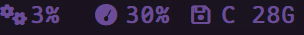

<div align="center">

# 🔲 AHK WM <sub>v2.8.4</sub>

<p>
  
  
  
  
  
</p>

<p>
  <a href="README.md"></a>
  <a href="README-zh.md"></a>
</p>

**A tiny, fast, single-file window manager for Windows — powered by AutoHotkey v2.**

</div>

---

## 📑 Contents

- [✨ Features](#-features)
- [📸 Screenshots](#-screenshots)
- [📦 Installation](#-installation)
- [🚀 Quick Start](#-quick-start)
- [🧰 Detailed Features](#-detailed-features)
  - [🖥️ Virtual Desktops](#️-virtual-desktops)
  - [🧩 Smart Tiling](#-smart-tiling)
  - [✋ KDE-style Drag](#-kde-style-drag)
  - [🥧 Pie Menu](#-pie-menu)
  - [📊 Status Bar](#-status-bar)
  - [🖼️ Window Borders](#️-window-borders)
  - [🔤 WinSelect](#-winselect)
  - [⌨️ WTM Mode](#️-wtm-mode)
  - [📐 Window Snapping](#-window-snapping)
  - [💾 Layout Save/Restore](#-layout-saverestore)
  - [🎨 Themes](#-themes)
  - [⏱️ Work Timer](#️-work-timer)
  - [📋 Clipboard History](#-clipboard-history)
  - [🔌 Editor & Terminal](#-editor--terminal)
  - [⚡ Power Menu & More](#-power-menu--more)
- [⚙️ Configuration](#️-configuration)
- [🛠️ Changelog](#️-changelog)
- [🔮 Roadmap](#-roadmap)
- [❓ Troubleshooting](#-troubleshooting)
- [🤝 Contributing](#-contributing)
- [📄 License](#-license)
- [⭐ Star History](#-star-history)

---

## ✨ Features

|  |  |  |
|---|---|---|
| 📄 **Single file** | One `.ahk` script, zero dependencies | 🧩 **Smart Tiling** | One-key layout per monitor |
| ⚡ **Fast** | No runtime framework | 🖥️ **9 Virtual Desktops** | Switch, move, gather via hotkeys |
| 🖥️ **Win 7 ~ 11** | All modern Windows versions | 🥧 **Pie Menu** | `Space + Right Mouse` |
| 🧹 **Low interference** | Shared-computer friendly | 📊 **Status Bar** | Gradient, rounded, multi-monitor |
| ⚙️ **INI config** | Edit and reload instantly | 🎨 **20+ Themes** | Nord, Dracula, Catppuccin, etc. |
| 🌈 **Gradient colors** | Bar, borders, PowerMenu | 📋 **Clipboard History** | Built-in logger & viewer |

> Two years of daily-use refinement. Built because every other Windows WM was too heavy and made my machine unusable for anyone else.

---

## 📸 Screenshots

| Preview | Description |
|---------|-------------|
|  | **Desktop Overview** — borders, tiling, multi-window layout |
|  | **Smart Tiling** — one key arranges all windows on current monitor |
|  | **Pie Menu** — radial menu, `Space + Right Mouse` |
|  | **WinSelect** — letter-labeled overlay for quick switching |
|  | **Status Bar** — desktop indicator, clock, date, progress bar |
|  | **Built-in Help** — `Alt + /` for full hotkey reference |

### 🎨 Bar Widgets (v2.8)

Per-element gradient backgrounds (`bg`), gradient text (`tx`), rounded corners, and **span-based alignment** — each widget is independently styled via the layout string.

<p align="center">
  
  <br/><em>Gradient bg widgets with rounded corners (desktops, date, time, progress, CPU, mem, disk)</em>
</p>

<p align="center">
  
  <br/><em>Close-up: gradient backgrounds and current-desktop highlight with rounded corners</em>
</p>

<p align="center">
  
  <br/><em>Layout configuration in action</em>
</p>

<p align="center">
  
  <br/><em>Configuration format: N,element,span,colors,bg|tx,on|off</em>
</p>

### 🌈 Gradient Borders (v2.8)

`BorderDrag`, `BorderPin`, and `BorderUnfocus` support comma-separated gradient colors.

<p align="center">
  
  <br/><em>Drag border with gradient color</em>
</p>

<p align="center">
  
  <br/><em>Border gradient in action</em>
</p>

---

## 📦 Installation

### Option 1: Run the `.ahk` script ⭐ Recommended

1. Install **AutoHotkey v2** → https://www.autohotkey.com/
2. Download `wm.ahk` from the [latest release](https://github.com/EngineeringMechanicsB/AHK_WM/releases/latest)
3. **Run as Administrator** (required for elevated windows)

Done.

### Option 2: Compiled `.exe`

Run the pre-compiled executable — no AHK installation needed for basic use.

<p align="center">
  <a href="https://github.com/EngineeringMechanicsB/AHK_WM/releases/latest">
    
  </a>
</p>

> ⚠️ Pie menu customization and some advanced features require AHK v2. Running the `.ahk` script is recommended.

---

## 🚀 Quick Start

| Action | Hotkey |
|--------|--------|
| 📖 Help page | `Alt + /` |
| 🧩 Tile current monitor | `Alt + D` |
| ✋ Move window (anywhere) | `Alt + Left Mouse` |
| 📐 Resize window (anywhere) | `Alt + Right Mouse` |
| 🔄 Switch desktop 1~9 | `Alt + 1 ~ 9` |
| 📦 Move window to desktop | `Alt + Shift + 1 ~ 9` |
| 🚀 Move & follow to desktop | `Ctrl + Alt + 1 ~ 9` |
| 📊 Toggle status bar | `Ctrl + Alt + B` |
| 💾 Save layout | `Alt + Shift + S` |
| 🔁 Restore layout | `Alt + Shift + R` |
| 🧲 Gather all windows | `Alt + Shift + G` |
| 🔍 Window transparency | `Alt + Mouse Wheel` |
| 📌 Toggle always-on-top | `Alt + T` |
| ❌ Close window under mouse | `Alt + Q` |
| 🔃 Reload script | `Alt + R` |
| 🛑 Safe exit | `Alt + F12` |
| ⚡ Power menu | `Alt + X` |
| 🥧 Pie menu | `Space + Right Mouse` |

> 💡 Press `Alt + /` anytime — the built-in help page lists every hotkey.

---

## 🧰 Detailed Features

### 🖥️ Virtual Desktops

9 desktops with independent focus tracking per desktop.

| Action | Hotkey |
|--------|--------|
| Switch to desktop 1~9 | `Alt + 1 ~ 9` |
| Move window to desktop | `Alt + Shift + 1 ~ 9` |
| Move window & follow | `Ctrl + Alt + 1 ~ 9` |
| Gather all windows here | `Alt + Shift + G` |

Hide method: **minimize** or **transparency**. Mark windows as always-visible across desktops.

```ini
[Desktop]
HideMethod=minimize        ; minimize | transparency
```

---

### 🧩 Smart Tiling

A single hotkey arranges all visible windows on the current monitor. Layouts adapt to monitor aspect ratio — **standard** (16:9/16:10), **vertical** (portrait), and **ultrawide** each get their own rules.

Default: `Alt + D`

```ini
[Tiling]
Gap=8
Rules=1,3,1,1/2,1;1,3,2,2/2,1/2;1,3,3,2/2,2/2;
```

**Rule format:** `M,N,I,X,Y`

| Field | Meaning | Example |
|-------|---------|---------|
| `M` | Monitor index (`*` = all) | `1` |
| `N` | Total windows on monitor | `3` |
| `I` | This window's index (1-based) | `2` |
| `X` | Horizontal span | `1` = full, `a/b` = segment a, `(a-c)/b` = segments a~c |
| `Y` | Vertical span | Same syntax |

**Exclude windows** by title, class, or process:
```ini
[Exclude]
Title=re:.*Steam.*;=Calculator
Class=AceApp
Process=devenv.exe;chrome.exe
```

Protected tiling boundaries via `SetTileBound` / `ClearTileBound`.

---

### ✋ KDE-style Drag

Move and resize from anywhere on the window — no need to grab the title bar.

```
Alt + Left Mouse  →  Move
Alt + Right Mouse →  Resize
```

DWM frame delta compensation for pixel-accurate positioning.

---

### 🥧 Pie Menu

8-direction radial menu on `Space + Right Mouse`. Items, opacity, font size, and center zone are all configurable.

```ini
[PieMenu]
SizePct=28
CenterZonePct=27
Opacity=78
FontSize=14
FontSizeActive=22
```

---

### 📊 Status Bar

Multi-monitor bar with proportional layout, **gradient colors**, **rounded corners**, and **alignment control**. Shows virtual desktops, clock, date, work progress, system stats, and custom text/icons.

```ini
[Bar]
HeightPct=3
Opacity=78
MonitorIdx=1
position=top              ; top | bottom
```

**Element layout format** (gradient + rounded + alignment):

```ini
; N,element,span,colors,bg|tx,on|off
layout=1,time,20/20,ff0000,00ff00,tx;desktops,(1-3)/20,FAB387,A020F0,bg,on;cpu,14/-20
```

| Parameter | Values | Notes |
|-----------|--------|-------|
| `N` | Bar instance # (default 1) | For multi-bar setups |
| `element` | desktops, time, date, progress, wifi, bluetooth, battery, volume, disk, mem, cpu, custom_1..n | |
| `span` | `a/b`, `a/+b`, `a/-b`, `(a-c)/b`, `(a-c)/+b`, `(a-c)/-b` | **`+`=right-align, `-`=left-align, none=center** |
| `colors` | One or more 6-digit hex (comma-separated) | Supports `#` prefix |
| `mode` | `bg` = colored background, `tx` = gradient text | |
| `rounded` | `on` or `off` | Rounded corners (bg mode) |

**Span alignment** — the `+`/`-` sign controls both individual cell text alignment AND overall group position within the span:

- `(1-3)/20` → centered in span
- `(1-3)/+20` → right-aligned group, text right-aligned
- `(1-3)/-20` → left-aligned group, text left-aligned

**Current desktop highlight** — set `current_desktop_color` with the same `colors,bg|tx,on|off` format to give the active desktop a distinct visual highlight:

```ini
current_desktop_color=FAB387,A020F0,bg,on
```

**Available elements**: `desktops`, `time`, `date`, `progress`, `wifi`, `bluetooth`, `battery`, `volume`, `disk`, `mem`, `cpu`, `custom_1`..`custom_n`

- Colors support `#` prefix: `#FF0000,#00FF00`
- Legacy `element:span,color` format still compatible
- Auto-hides when a fullscreen app is detected
- Pause-on-fullscreen option (`[General] PauseOnFullscreen=on`)
- Toggle: `Ctrl + Alt + B` · Reload: `Alt + R`

---

### 🖼️ Window Borders

Visual borders for active, dragged, pinned, and managed windows — now with **gradient color support**.

| Mode | Purpose |
|------|---------|
| **Focus border** | Highlights the active window |
| **Drag border** | Visual feedback during move/resize |
| **Pin border** | Marks always-on-top windows |
| **All-window borders** | Borders on every visible window |

```ini
[Border]
Mode=full                  ; full | top
Thickness=15
RoundedCorners=on
Radius=10
; Colors support gradients: color1,color2,...
```

Border colors (`BorderDrag`, `BorderPin`, `BorderUnfocus`) support comma-separated gradient colors.

---

### 🔤 WinSelect

Letter-labeled overlay — press a key to jump to that window. Scales windows down, overlays letters. Sidebar mode with configurable position. Auto-dismiss on timeout. Restores always-on-top state on exit.

```ini
[WinSelect]
SidebarWidth=200
SidebarPosition=right     ; left | right
Timeout=3000
```

---

### ⌨️ WTM Mode

Keyboard-driven dynamic tiling preview. Auto-tiles on activation, has its own border system, desktop-switch aware.

> ⚠️ **Experimental** — hotkeys disabled by default.

```ini
[WTM]
BorderMode=full
BorderFocusColor=A020F0
BorderThickness=8
Gap=10
```

Enable it:
```ini
[Hotkeys]
WTMToggle=Alt+Shift+D
```

---

### 📐 Window Snapping

Edge snapping during move and resize — snaps to other window edges and screen edges.

```ini
[Snapping]
SnapDistance=10
SnapReleaseDistance=20
```

---

### 💾 Layout Save/Restore

Snapshot and restore all window positions, sizes, and states.

| Action | Hotkey |
|--------|--------|
| Save layout | `Alt + Shift + S` |
| Restore layout | `Alt + Shift + R` |

---

### 🎨 Themes

20+ built-in themes, instant hot-switching. Each defines: background, text, accent, task, border, pie menu, power menu, and WTM colors.

```
nord · tokyonight · dracula · gruvbox · monokai
solarized-dark · solarized-light · catppuccin-mocha · catppuccin-latte
onedark · ayu-dark · github-dark · rose-pine · everforest
kanagawa · material-deep · nightfox · palenight · horizon · oxocarbon
```

Switch from the system tray menu or config. Export current theme with `ExportThemeToCustom()`.

---

### ⏱️ Work Timer

Status bar progress bar showing how far through the workday you are.

```ini
[WorkTime]
Mode=off
WorkStart=0900
WorkEnd=1745
TaskTimes=1_1200_1300     ; Monday 12:00-13:00 (lunch)
```

Per-weekday task slots, weekend bar option, percentage display.

---

### 📋 Clipboard History

Monitors clipboard changes and logs them to file. Built-in viewer for reviewing past clips. Includes 200ms debounce to suppress rapid duplicate triggers.

```ini
[Paths]
OutputDir=C:\Users\...\Documents
OutputFile=CB.txt
```

---

### 🔌 Editor & Terminal

Quick-launch terminal and editor from anywhere. Explorer integration — get selected files, get current path.

```ini
[Paths]
VimPath=C:\path\to\your\editor.exe
TerminalExe=wt.exe         ; Windows Terminal
```

---

### ⚡ Power Menu & More

**Power menu** (`Alt + X`): shutdown, sleep, reboot. Button colors follow the active theme.

Additional features:
- 🖱️ **System tray** — right-click for theme switch, reload, safe exit
- 🛡️ **Fault isolation** — `WMGuard()` wraps all operations in try/catch
- 📝 **Error logging** — `WMLogErr()` deduplicates repeated errors
- 🔄 **Auto config repair** — missing keys added on every startup
- 🔍 **Transparency** — `Alt + Mouse Wheel` on any window
- 📌 **Always-on-top** — `Alt + T`
- 🔇 **Minimize** window under mouse
- 🖥️ **Maximize** window under mouse

---

## ⚙️ Configuration

Single INI file:

```
%USERPROFILE%\.config\AHK_WM\wm_config.ini
```

| Section | Purpose |
|---------|---------|
| `[General]` | Theme, font, transparency step, pause-on-fullscreen |
| `[Theme]` | All color definitions (gradients supported) |
| `[Paths]` | Editor, terminal, clipboard log paths |
| `[Desktop]` | Virtual desktop count, hide method |
| `[Bar]` | Height, opacity, layout, alignment, rounded corners |
| `[Border]` | Mode, thickness, colors, rounded corners |
| `[Tiling]` | Gap, custom layout rules, exclusions |
| `[WTM]` | Keyboard tiling mode settings |
| `[PieMenu]` | Size, opacity, font settings |
| `[GUI]` | Help window & OSD preferences |
| `[WorkTime]` | Work hours, task slots, progress bar |
| `[Exclude]` | Window exclusions (title/class/process) |
| `[Hotkeys]` | All keybindings |
| `[Snapping]` | Snap distance, release distance |
| `[WinSelect]` | Sidebar position, width, timeout |

> 💡 Edit config, press `Alt + R` to reload — no restart needed.

---

## 🛠️ Changelog

### v2.8.4 (2026-07-01)

- 🐛 **Clipboard fixed** — `RecordClipboard()` was missing `FileAppend`; history is now actually written to file
- 🐛 **Bar white edge fixed** — `RoundWindowEx` now disables DWM non-client rendering before `SetWindowRgn`, eliminating white artifacts on Win10 19041+
- 🐛 **ShowWin fixed** — `SW_SHOWNA(8)` → `SW_RESTORE(9)`; minimized windows now restore correctly
- 🐛 **Desktops white clipping** — layoutBg creation moved to `_BuildElements` (same timing as other elements), resolving alignment-dependent white gaps
- 🆕 **Span alignment** — `+`/`-` sign in span format now controls both group positioning and text alignment
- 🆕 **Tx mode in highlight** — `tx` mode correctly renders desktop labels with default color when no background is specified
- 🧹 **GDI leak** — task-marker bitmaps now tracked and released on bar destroy
- 🧹 **Cleanup** — removed legacy globals, deduplicated INI parsing, added `Persistent` directive
- ⚡ **Clipboard debounce** — 200ms filter suppresses rapid duplicate fires

### v2.8.0 (2026-06-29)

- 🌈 **Gradient colors** — bar elements, borders, and PowerMenu now support gradient backgrounds and gradient text
- 🔲 **Bar rounded corners** — per-element `on|off` switch for bg-mode rounded corners
- 🎨 **Bar layout overhaul** — new `N,element,span,colors,bg|tx,on|off` format with granular control
- 🔧 **Border gradient** — `BorderDrag`/`BorderPin`/`BorderUnfocus` support comma-separated gradient colors
- ⚙️ **Pause-on-fullscreen** — `[General] PauseOnFullscreen=on` suspends hotkeys when gaming
- 🔍 **Transparency step** — configurable step size, snap to multiples
- 🧹 **Code cleaned** — removed legacy migration, legacy WTM globals, redundant sections
- 🐛 **Fixed** — bg rounded corners, single-color bg rendering, transparency minimum, help/OSD theme follow

### v2.6.4 (2026-06-18)

- 🆕 **Config integrity check** — auto-detect missing keys & add defaults on every startup
- 🐛 **Pin border rounding** — now reads from config
- 🔧 **DWM compensation** — extracted into shared function

---

## 🔮 Roadmap

- **Config consolidation** — clean up two years of accumulated INI cruft
- **WTM mode** — edge cases, crash recovery, multi-monitor improvements
- **Per-monitor desktops** — independent desktop switching per monitor
- **Package managers** — Scoop, Chocolatey, winget distribution

---

## ❓ Troubleshooting

| Symptom | Fix |
|---------|-----|
| Hotkeys fail in admin windows | Run script as Administrator |
| Pie menu customization broken | Install AHK v2 (not just the .exe) |
| Games / UWP act strange | Add to `[Exclude]` |
| Status bar hidden by fullscreen | By design. Toggle with `Ctrl+Alt+B` |
| Borders look offset | Adjust `Border` thickness or radius |
| Remote Desktop issues | Some features differ over RDP (DWM changes) |

---

## 🤝 Contributing

- 🐛 **Bug reports** — Open an issue with repro steps and Windows version
- 💡 **Feature requests** — Open an issue with the `enhancement` label
- 🔧 **Pull requests** — Welcome. For large changes, open an issue first.
- 🎨 **Themes** — Submit with a screenshot.

---

## 📄 License

[MIT](LICENSE) © 2024-2026 EngineeringMechanicsB

---

## ⭐ Star History

[](https://star-history.com/#EngineeringMechanicsB/AHK_WM&Date)

---

<p align="center">
  <sub>Made with AutoHotkey v2 · Two years and counting</sub>
</p>
