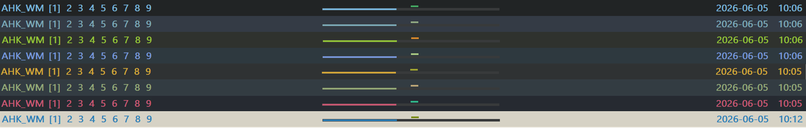

# AHK WM

A tiny, fast, single-file window manager for Windows, powered by **AutoHotkey v2**.

AHK WM is built for people who keep too many windows open and still want their desktop to feel light, predictable, and easy to escape from.

-  **Single-file script**
-  **Small size**, around 130 KB
-  **Fast response**, no heavy background framework
-  **Works from Windows 7 to Windows 11**
-  **Minimal interference**, friendly for shared/work computers
-  **Config-file driven**, no complex setup required
-  Virtual desktops, smart tiling, KDE-style dragging, pie menu, status bar, borders, GUI help page, and more

> I made this script because many Windows window managers felt too heavy, too laggy, or too disruptive for my daily work setup.  
> This project has been written and used in real work for about two years.

### Screenshots


### Status Bar



### Pie Menu


### Help Menu


### Smart Tile


## Installation

### Option 1: Run the `.ahk` script

1. Install official **AutoHotkey v2**  
   <https://www.autohotkey.com/>

2. Download or copy this script to your local machine.

3. Run the script as administrator.

That is all.

> Administrator permission is recommended because window moving, resizing, and some hotkeys may not work correctly with elevated applications otherwise.

### Option 2: Run the compiled version

You can also run the compiled `.exe` version directly.

However:

> If AutoHotkey v2 is not installed, the pie menu / radial menu may not work correctly.

For the full experience, installing AutoHotkey v2 is still recommended.

## Basic Usage

Default useful hotkeys:

| Action                     | Hotkey              |
| -------------------------- | ------------------- |
| Show / Hide Help Menu      | `Alt + /`           |
| Smart Tile Current Monitor | `Alt + D`           |
| Move Window                | `Alt + Left Mouse`  |
| Resize Window              | `Alt + Right Mouse` |
| Switch Desktop             | `Alt + 1-9`         |
| Move Window to Desktop     | `Alt + Shift + 1-9` |
| Move and Switch Desktop    | `Ctrl + Alt + 1-9`  |
| Toggle Top Bar             | `Ctrl + Alt + B`    |
| Save Layout                | `Alt + Shift + S`   |
| Restore Layout             | `Alt + Shift + R`   |
| Gather All Windows         | `Alt + Shift + G`   |
| Close Window               | `Alt + Q`           |
| Reload Script              | `Alt + R`           |
| Exit Safely                | `Alt + F12`         |
| Power Menu                 | `Alt + X`           |

If you forget the shortcuts, press:

```tex
Alt + /
```

The built-in help page will show the available actions.

## Main Features

### Virtual Desktops

AHK WM provides a lightweight virtual desktop system.

You can:

- switch between desktops
- move windows to another desktop
- move a window and switch to that desktop
- choose how inactive windows are hidden

###  Smart Tiling

Quickly arrange windows on the current monitor.

Default hotkey:

```text
Alt + D
```

Config:

```ini
[Tiling]
Gap=8
Rules=1,3,1,1/2,1;1,3,2,2/2,1/2;1,3,3,2/2,2/2;
```

Rule format:

```text
M,N,I,X,Y
```

Meaning:

```text
M = monitor index, or * for all monitors
N = total number of tiled windows
I = current window index
X = horizontal span
Y = vertical span
```

Span syntax:

```text
1       = full axis
a/b     = segment a of b
(a-c)/b = segments a through c of b
```

### KDE-style Window Dragging

Move or resize a window from anywhere.

Default hotkeys:

```text
Alt + Left Mouse   = move window
Alt + Right Mouse  = resize window
```

This is useful when you do not want to aim at the title bar.

### Pie Menu

AHK WM includes a customizable radial menu.

Default trigger:

```text
Space + Right Mouse
```

Config:

```ini
[PieMenu]
SizePct=28
CenterZonePct=27
Opacity=78
FontSize=14
FontSizeActive=22
```

You can use the pie menu for quick actions, shortcuts, tools, or your own workflow commands.

### Status Bar

The bar can show:

- desktops
- time
- date
- progress
- custom text / icons / emoji

Config:

```ini
[Bar]
HeightPct=3
Opacity=78
FontSize=10
MonitorIdx=1

desktops=true
time=true
date=true
progress=true

time_format=HH:mm
date_format=yyyy-MM-dd

custom_items=Edit Configuration file to hide
layout=custom_1:(2-5)/10;desktops:(1-3)/20;date:(18-19)/20;time:20/20

position=top
offset=0
AutoHideOnFullscreen=off
```

Custom items use this format:

```ini
custom_items=text_1;icon_1;text_2
```

Then reference them in `layout` as:

```ini
layout=custom_1:1/10;custom_2:2/10;custom_3:3/10
```

Bar position currently supports:

```text
top | bottom
```

### Window Borders

AHK WM can draw borders for focused, dragged, pinned, or managed windows.

Config:

```ini
[Border]
RefreshMs=10

DragEnable=on
DragMode=full
DragThickness=15
DragOpacity=70
DragRounded=on
DragRadius=10

PinMode=top
PinThickness=10
PinOpacity=78
```

Border mode:

```text
top   = only top border
full  = full border
```

Pinned border has the highest priority.

### WTM Mode

WTM is a preview tiling mode for keyboard-driven window control.

Default WTM hotkeys may be disabled in the config by default because this feature is still under testing.

Config:

```ini
[WTM]
BorderMode=full
BorderFocusColor=A020F0
BorderUnfocusColor=555555
BorderThickness=8
BorderOpacity=80
SizeStep=3
Gap=10
RoundedCorners=on
CornerRadius=10
```

Default navigation keys:

```text
Alt + H/J/K/L          = focus window
Alt + Shift + H/J/K/L  = move / swap window
```

Enable the toggle hotkey in config if needed:

```ini
[Hotkeys]
WTMToggle=Alt+Shift+D
```

### GUI Help Page

Default hotkey:

```text
Alt + /
```

Config:

```ini
[GUI]
HelpFontSize=10
HelpWidth=620
HelpHeight=0
HelpOpacity=255
```

`HelpHeight=0` means automatic height.

### Power Menu

Default hotkey:

```text
Alt + X
```

Config:

```ini
[GUI]
PowerFontSize=12
PowerWidth=500
PowerHeight=160
PowerOpacity=255
```

Theme colors:

```ini
[Theme]
PowerMenuBg=2E3440
PowerBtnShutdown=B48EAD
PowerBtnSleep=5E81AC
PowerBtnReboot=BF616A
```

### Transparency Control

Default hotkeys:

```text
Alt + WheelUp
Alt + WheelDown
```

Useful when you want to see reference content behind a window.

### Save / Restore Layout

Default hotkeys:

```text
Alt + Shift + S  = save layout
Alt + Shift + R  = restore layout
```

Useful for repeated workspaces or temporary window arrangements.

### Exclude Windows

Some windows should not be moved or resized by tiling / WTM.

Config:

```ini
[Exclude]
Titles=Picture-in-Picture
Classes=
Processes=
```

Title match rules:

```text
text      = contains match
=text     = exact match
re:regex  = regex match
```

## Configuration

The script uses an `.ini` configuration file.

Main sections:

```ini
[General]
[Theme]
[Paths]
[Desktop]
[Bar]
[Border]
[Tiling]
[WTM]
[PieMenu]
[GUI]
[WorkTime]
[Exclude]
[Hotkeys]
```

Most options can be edited directly.

After editing the config, reload the script:

```text
Alt + R
```

## Themes

Built-in theme names include:

```text
custom
nord
tokyonight
dracula
gruvbox
monokai
solarized-dark
solarized-light
catppuccin-mocha
catppuccin-latte
onedark
ayu-dark
github-dark
rose-pine
everforest
kanagawa
material-deep
nightfox
palenight
horizon
oxocarbon
```

Example:

```ini
[General]
ActiveTheme=custom

[Theme]
Background=0e050f
Text=e5e9f0
Active=744da9
Task=CF8DC9
BorderDrag=A020F0
BorderPin=FF5555
BorderUnfocus=666666
```

Color values are hex RGB without `#`.

## Work Time / Progress

Config:

```ini
[WorkTime]
Mode=off
WeekendBar=off
WorkStart=0900
WorkEnd=1745
TaskTimes=1_1200_1300;2_1200_1300;
```

Time format:

```text
HHMM
```

Task time format:

```text
Weekday_Start_End
```

Weekday:

```text
1 = Monday
2 = Tuesday
3 = Wednesday
4 = Thursday
5 = Friday
6 = Saturday
7 = Sunday
```

Example:

```text
1_1200_1300
```

means:

```text
Monday 12:00 - 13:00
```

## Default Hotkeys

```ini
[Hotkeys]
Help=Alt+/
Exit=Alt+F12
Reload=Alt+R

DesktopSwitchPrefix=Alt
DesktopMovePrefix=Alt+Shift
DesktopMoveSwitchPrefix=Ctrl+Alt

TileSmart=Alt+D
GatherAll=Alt+Shift+G
TogglePin=Ctrl+Alt+T
ToggleBar=Ctrl+Alt+B
SaveLayout=Alt+Shift+S
RestoreLayout=Alt+Shift+R

CloseWindow=Alt+Q
CloseWindowAlt=Alt+MButton
ToggleMaximize=Alt+F
ToggleTop=Alt+T
HideWindow=Alt+W

TransparencyUp=Alt+WheelUp
TransparencyDown=Alt+WheelDown

SnapLeft=Alt+Left
SnapRight=Alt+Right
SnapUp=Alt+Up
SnapDown=Alt+Down

LaunchTerminal=Alt+Enter
EditFile=Alt+V
PowerMenu=Alt+X
ClipboardHistory=Ctrl+``

DragMove=Alt+LButton
DragResize=Alt+RButton

PieMenuTrigger=~Space & RButton
```

Some testing features may be disabled by default:

```ini
ToggleAllBorders=
WTMToggle=
```

You can assign hotkeys manually if you want to test them.

## Notes

AHK WM tries to stay simple.

It is not a full desktop environment.  
It is not trying to replace Windows.  
It just tries to make daily window management faster and less annoying.

Known notes:

- WTM mode is still experimental.
- Some special windows may need exclusions.
- Admin windows may require the script to run as administrator.
- Games, UWP apps, remote desktop windows, and security tools may behave differently.
- If something looks wrong, reload the script first.

Happy to use. ✨
